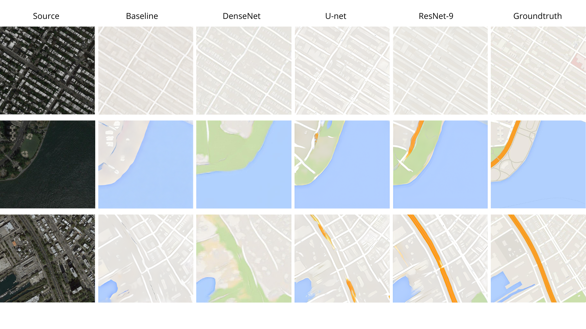

# Satellite-to-Map-rendering-using-C-GANs
CS230 project

This study presents a comprehensive investigation of conditional generative adversarial networks

(C-GANs) for aerial-to-map image translation. We implement and compare multiple generator archi-
tectures including U-Net, ResNet, and DenseNet variants, paired with both PatchGAN and ImageGAN

discriminators. Through extensive experimentation with limited training data (1,097 image pairs), we
demonstrate that sophisticated architectural choices significantly impact translation quality. The study
also explores the effects of different normalization techniques, loss functions, and training strategies on
model convergence and output quality.

-- full raport paper available on: https://drive.google.com/file/d/1480JfCwiwIkwS0HehhVq8nj_r6KZDouO/view?usp=drive_link
